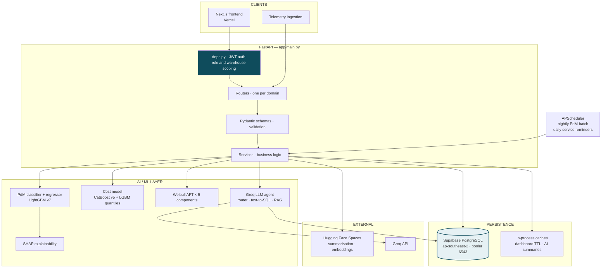
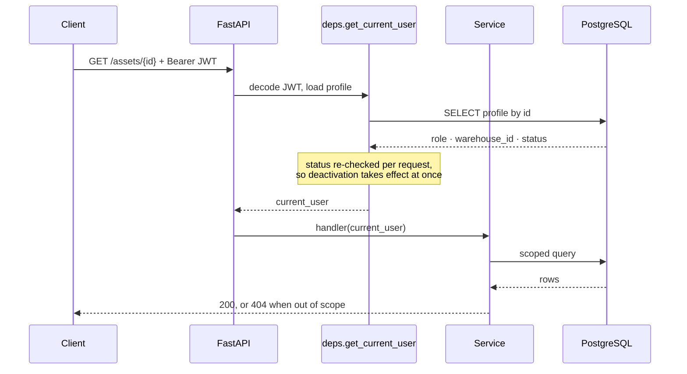
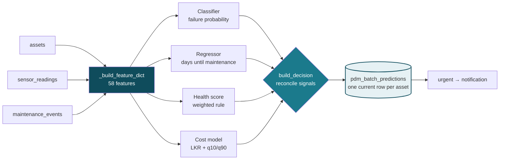
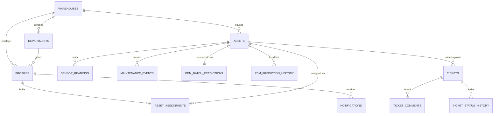
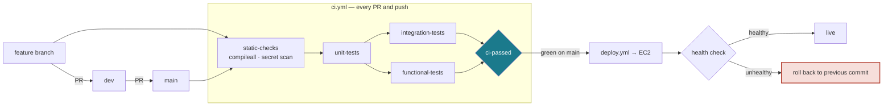

# PredictiX — AI-Powered Fleet & Asset Management Backend


PredictiX is a predictive maintenance platform for fleet and warehouse operations. It ingests
vehicle telemetry, predicts whether an asset will need maintenance within a 30-day horizon,
estimates when and at what cost, and forecasts remaining life for five individual components.
Results are served through a role-scoped FastAPI REST API and are queryable in natural language
through a retrieval-augmented assistant.

Gradient-boosted models (LightGBM, CatBoost), Weibull AFT survival analysis, SHAP explainability
and Groq LLM agents sit behind the API, backed by Supabase PostgreSQL.

---

## Live Deployment

| Component | Platform | URL |
|---|---|---|
| Frontend | Vercel | [predicti-x-frontend.vercel.app](https://predicti-x-frontend.vercel.app) |
| REST API | AWS EC2 (systemd + nginx) | set per environment as the `BACKEND_PUBLIC_URL` CI variable |
| Database | Supabase PostgreSQL (`ap-southeast-2`) | private — transaction pooler, port 6543 |
| Inference API | Hugging Face Spaces | [dinusha-ekanayake-predictix-inference-api.hf.space](https://dinusha-ekanayake-predictix-inference-api.hf.space) |
| Asset summariser | Hugging Face Spaces | `SharadaAbeywickrama/Asset_summery_generation` |
| Ticket summariser | Hugging Face Spaces | `SharadaAbeywickrama/Ticket_summery_generation` |

> The API host is not committed to the repository. It is supplied to CI as a repository
> variable so the instance can be rebuilt or moved without a code change. See
> [`docs/CICD.md`](docs/CICD.md).

Interactive API documentation is served by the running instance at `/docs` (Swagger UI)
and `/redoc`.

---

## Table of Contents

- [Live Deployment](#live-deployment)
- [Tech Stack](#tech-stack)
- [Architecture Overview](#architecture-overview)
- [Project Structure](#project-structure)
- [Database Models](#database-models)
- [API Endpoints](#api-endpoints)
- [ML / AI Components](#ml--ai-components)
- [Dashboard Caching](#dashboard-caching)
- [Authentication](#authentication)
- [Configuration & Environment Variables](#configuration--environment-variables)
- [Getting Started](#getting-started)
- [Database Migrations](#database-migrations)
- [Seeding the Database](#seeding-the-database)
- [Testing](#testing)
- [Continuous Integration and Deployment](#continuous-integration-and-deployment)
- [Deployment](#deployment)
- [Background Jobs](#background-jobs)
- [Development Notes](#development-notes)

---

## Tech Stack

| Layer | Technology |
|---|---|
| Web Framework | FastAPI + Uvicorn (ASGI) |
| Database | PostgreSQL via Supabase |
| ORM / Migrations | SQLAlchemy + Alembic |
| Authentication | JWT (python-jose) + bcrypt |
| ML — Classification | LightGBM v7 — 30-day maintenance probability (500 trees, 58 features) |
| ML — Regression | LightGBM v7 — days until next maintenance (500 trees, 58 features) |
| ML — Cost | CatBoost v5 point estimate + two LightGBM quantile models for the 80% interval |
| ML — Survival | lifelines / Weibull AFT — per-component RUL across 5 components |
| Explainability | SHAP |
| NLP / GenAI | Groq Llama-3.3-70B, LangChain, HuggingFace Transformers + PyTorch |
| PDF Generation | ReportLab |
| Task Scheduling | APScheduler (configurable PDM batch + daily service reminders) |
| Data Processing | pandas, numpy |
| Config | pydantic-settings |
| Python Version | 3.12+ |

---

## Architecture Overview



### Request lifecycle

Every authenticated request resolves the caller's profile, role and active warehouse before a
handler runs. Scoping is enforced in Python: the API connects to Postgres as an owner role, so
row-level security policies do not apply on this path.



### Prediction pipeline

The nightly batch is the spine of the platform. Four model outputs enter a decision layer, and
one tiered recommendation per asset leaves.



When a model fails for an asset, the row is written with `status = "error"` and a null
probability rather than a substituted default, so a caller can always tell a real prediction
from a missing one.

### Core data model

Populated tables only. `warehouses` is the root of the access model — every scoped query
resolves back to it.



---

## Project Structure

```
PredictiX_backend/
├── app/
│   ├── main.py                      # FastAPI entry point, lifespan, CORS, router registration
│   ├── models.py                    # SQLAlchemy ORM — 20+ database tables
│   ├── deps.py                      # JWT auth + DB session dependency injection
│   ├── core/
│   │   ├── config.py                # Pydantic Settings
│   │   ├── security.py              # Password hashing & JWT utilities
│   │   └── storage.py               # File storage helpers
│   ├── db/
│   │   ├── base.py                  # SQLAlchemy declarative base
│   │   ├── session.py               # Engine and SessionLocal initialization
│   │   └── supabase_client.py       # Supabase Python client setup
│   ├── routers/                     # 37 API router modules (one per domain)
│   ├── schemas/                     # Pydantic request/response models (17 files)
│   ├── services/
│   │   ├── dashboard_cache.py       # TTL-based full-response payload cache
│   │   ├── ai_summary_cache.py      # Non-blocking background AI summary refresh
│   │   ├── report_service.py        # Report generation orchestration
│   │   ├── pdf_render.py            # ReportLab PDF builder
│   │   ├── pdf_styles.py            # PDF styling templates
│   │   ├── notification_service.py  # Multi-channel notifications
│   │   ├── in_app_notification_service.py
│   │   ├── user_ticket_service.py
│   │   └── reference_data_cache.py  # Low-churn lookup cache
│   ├── agents/
│   │   └── report_agents.py         # Groq RAG agent for warehouse reports
│   ├── ai/
│   │   ├── models/                  # Serialized ML model files (.pkl, .safetensors)
│   │   │   ├── pdm_classifier_model/
│   │   │   ├── pdm_regressor_model/
│   │   │   ├── cost_estimation_model/
│   │   │   └── survival_analysis/
│   │   ├── services/                # AI orchestration, HF/Gradio clients, batch PDM
│   │   └── agent/                   # Tool-calling Groq agent loop + tools
│   ├── kb/                          # Knowledge base & vector store (WIP)
│   └── tests/                       # Unit tests
├── seed_data/                       # SQL fixtures and demo data scripts
├── alembic/                         # Database migration scripts
├── docs/                            # Developer notes and lessons
├── requirements.txt
└── alembic.ini
```

---

## Database Models

### Organisation & Users

| Model | Key Fields |
|---|---|
| `Profile` | user_id (Supabase auth), email, role, warehouse_id, department_id |
| `Warehouse` | name, city, timezone, climate_zone, total_assets |
| `Department` | name, warehouse_id |

### Assets & Operations

| Model | Key Fields |
|---|---|
| `Asset` | vin, make, model, year, type, status, health_band, criticality_score, mileage |
| `AssetAssignment` | asset_id, user_id, start_date, end_date |
| `AssetStatusHistory` | asset_id, previous_status, new_status, changed_by, timestamp |
| `AssetDocument` | asset_id, file_url, document_type |
| `MaintenanceEvent` | asset_id, event_type, status, cost, downtime_hours, vendor, scheduled_date |
| `SensorReading` | asset_id, timestamp, temperature, rpm, fuel_level, tire_pressure, battery_voltage, vibration, custom JSONB |

### Tickets

| Model | Key Fields |
|---|---|
| `Ticket` | asset_id, title, description, status, priority, category, ai_category, ai_summary, closed_at |
| `TicketComment` | ticket_id, author_id, body, is_internal |
| `TicketAttachment` | ticket_id, file_url |
| `TicketStatusHistory` | ticket_id, previous_status, new_status, changed_by |

### Predictions & ML

| Model | Key Fields |
|---|---|
| `PredictionRun` | asset_id, model_name, model_version, input_snapshot, timestamp |
| `AssetFailurePrediction` | asset_id, run_id, health_score, failure_probability, days_until_maintenance, risk_level |
| `AssetCostPrediction` | asset_id, run_id, estimated_cost, min_cost, max_cost |
| `TicketPrediction` | ticket_id, run_id, predicted_category, predicted_priority, ai_summary |
| `PredictionExplanation` | run_id, feature_importances (JSON) |
| `PredictionFeatureImportance` | run_id, feature_name, importance_score, rank |
| `ModelRegistry` | model_name, version, framework, metrics, is_active |

### Notifications & Reporting

| Model | Key Fields |
|---|---|
| `Notification` | user_id, type, channel, message, is_read, asset_id, ticket_id |
| `UserNotificationPreference` | user_id, notification_type, channel, enabled |
| `Report` | title, type, generated_by, output (JSON) |
| `ReportSource` | report_id, source_type, source_id, relevance_score |

---

## API Endpoints

### Authentication

| Method | Path | Description |
|---|---|---|
| POST | `/auth/login` | Login with email + password + role, returns JWT |
| GET | `/auth/test` | Auth health check |

### Profiles & Users

| Method | Path | Description |
|---|---|---|
| GET/POST | `/profiles` | Profile list and creation |
| GET/PUT | `/profiles/{id}` | Get or update profile |
| GET/PUT | `/profiles/me` | Current user's profile |
| GET | `/profiles/me/assets` | Assigned assets |
| GET | `/profiles/me/stats` | Asset count stats |
| GET/POST | `/users` | User management CRUD |

### Organisation

| Method | Path | Description |
|---|---|---|
| GET/POST/PUT/DELETE | `/warehouses` | Warehouse CRUD |
| GET/POST/PUT/DELETE | `/departments` | Department CRUD |

### Assets

| Method | Path | Description |
|---|---|---|
| GET | `/assets` | List with filters (search, warehouse, status, health_band, criticality) |
| POST | `/assets` | Create asset |
| GET/PUT/DELETE | `/assets/{id}` | Retrieve, update, delete asset |
| GET | `/assets/{id}/usage-history` | Recorded monthly operating history (hours run/idle, distance, service cadence, downtime) for the asset panel's charts |
| GET/POST | `/asset-assignments` | Assignment records |
| GET | `/asset-status-history` | Status audit log |
| GET/POST | `/asset-documents` | Document management |
| GET/POST | `/asset-summaries/generate` | AI-generated asset descriptions |
| POST | `/asset-reports/{asset_id}` | Generate full PDF report to Supabase Storage |
| GET | `/asset-reports/dummy/pdf` | Dummy PDF for styling test |

### Maintenance & Sensors

| Method | Path | Description |
|---|---|---|
| GET/POST/PUT/DELETE | `/maintenance` | Maintenance event CRUD |
| GET | `/sensor-readings` | Query historical sensor data |
| POST | `/sensor-readings` | Ingest IoT sensor reading |

### Tickets

| Method | Path | Description |
|---|---|---|
| GET/POST/PUT/DELETE | `/tickets` | Ticket CRUD with filters |
| POST | `/tickets/categorize` | AI-powered ticket categorisation |
| GET/POST | `/ticket-comments` | Discussion threads |
| GET/POST | `/ticket-attachments` | File uploads |
| GET | `/ticket-status-history` | Audit trail |
| GET/POST/PUT/DELETE | `/user/tickets` | User-facing ticket interface |

### Predictions

| Method | Path | Description |
|---|---|---|
| POST | `/predictions/classification` | Failure probability (0–1) |
| POST | `/predictions/regression` | Days until maintenance |
| POST | `/predictions/full` | Combined prediction + SHAP |
| GET | `/predictions/runs` | Prediction run history |
| GET | `/predictions/failure/{asset_id}` | Latest failure prediction |
| GET | `/predictions/cost/{asset_id}` | Cost estimate |
| POST | `/vehicle-predictions/{asset_id}` | Run full prediction and persist to DB |
| GET | `/batch-predictions` | Batch run management |
| GET | `/prediction-explanations/{run_id}` | SHAP values for a run |
| GET/POST | `/model-registry` | ML model versioning |

### Survival Analysis

| Method | Path | Description |
|---|---|---|
| GET | `/survival/summary` | Weibull AFT survival curves for warehouse fleet |
| GET | `/survival/watchlist` | Assets with RUL < 30 days |

### Dashboards

| Method | Path | Description |
|---|---|---|
| GET | `/admin-dashboard/summary` | Full admin KPI payload (cached) |
| GET | `/warehouse-dashboard/summary` | Warehouse KPI payload (cached) |
| GET | `/warehouse-dashboard/generate-report` | RAG-powered AI warehouse report via Groq |
| POST | `/warehouse-dashboard/notify-print` | Log a report print event |
| GET | `/warehouse-dashboard/maintenance-schedule` | Predictive maintenance schedule |

### Notifications & Reports

| Method | Path | Description |
|---|---|---|
| GET | `/notifications` | User notification feed |
| PUT | `/notifications/{id}/mark-read` | Mark as read |
| GET/POST | `/notification-preferences` | Preference management |
| GET/POST | `/reports` | Report metadata CRUD |
| GET/POST | `/faqs` | Knowledge base CRUD |

### Chatbot & WebSocket

| Method | Path | Description |
|---|---|---|
| POST | `/chatbot/ask` | Legacy RAG Q&A (no auth) |
| POST | `/chatbot/agent` | Tool-calling Groq agent (JWT required) |
| WS | `/ws` | Real-time WebSocket connection |

### Warmup

| Method | Path | Description |
|---|---|---|
| POST | `/warmup/inference-space` | Public, non-blocking ping that wakes the Gradio/HuggingFace ticket inference Space before a real user action needs it |

---

## ML / AI Components

### Local Models (loaded at startup)

| Model | File | Task | Output |
|---|---|---|---|
| PDM Classifier | `app/ai/models/pdm_classifier_model/predictive_maintenance_model.pkl` | Failure probability | 0–1 score, risk level, recommended action |
| PDM Regressor | `app/ai/models/pdm_regressor_model/days_until_next_maintenance_regressor.pkl` | Days until maintenance | Numeric estimate + SHAP importances |
| Survival Analysis | `app/ai/models/survival_analysis/` | Component RUL (Weibull AFT) | Survival curves, 30/90-day risk flags |

### Remote HuggingFace / Gradio Models (optional)

Set `DISABLE_HF_MODELS=false` in `.env` to enable. Models load lazily on first request and are cached in memory. GPU is used automatically when available.

| Purpose | Repo |
|---|---|
| Ticket categorisation | `Dinusha-Ekanayake/predictix-ticket_categorization_model` |
| Ticket summarisation | `Dinusha-Ekanayake/predictix-ticket_summarization_model` |
| Ticket prioritisation | `AroshN/priority_classif_xgb` |
| Asset summarisation | `Dinusha-Ekanayake/predictix-asset_summarization_model` |

Ticket categorisation and priority can also route through the external Gradio Space configured by `HF_AI_SPACE_URL`. The `/warmup/inference-space` endpoint pings that Space's `/config` route so the login page can wake it without blocking authentication.

### Groq LLM Agent

- **Model:** `llama-3.3-70b-versatile`
- **Warehouse reports:** `GET /warehouse-dashboard/generate-report` — queries 8 live PostgreSQL tables, injects context into Groq, returns structured JSON with 5 AI sections
- **Chatbot agent:** `POST /chatbot/agent` — tool-calling loop with 11+ tools (asset lookup, prediction run, ticket query, etc.)
- **Rate-limit handling:** On Groq 429 errors, the AI summary cache backs off automatically for 90 minutes (matching the free-tier daily TPD reset window)

### SHAP Explainability

CatBoost regressor predictions include per-feature SHAP values stored in `PredictionExplanation` and `PredictionFeatureImportance` tables, served to the frontend for risk driver visualisation.

---

## Dashboard Caching

Both dashboard endpoints use a TTL-based in-memory `DashboardCache` to eliminate repeated network round-trips to Supabase (each query adds ~170–250ms RTT to ap-southeast-2):

- **First request** — builds the full payload synchronously (consolidated SQL queries with `FILTER` aggregates and `width_bucket()`)
- **Within TTL** — returns cached payload instantly (~15ms)
- **After TTL** — returns stale payload immediately, starts a background thread to refresh

The admin dashboard AI summary is managed separately by `ai_summary_cache.py`:

- Refreshes every 10 minutes in a background daemon thread
- Never blocks the request path
- Falls back to a data-driven KPI string when no LLM summary is available

Configure TTL via environment variables. The code defaults are short for development (`60`, `60`, and `600` seconds), but EC2/free-tier deployments should use longer TTLs to reduce Supabase request volume:

```env
ADMIN_DASHBOARD_TTL=1800
WAREHOUSE_DASHBOARD_TTL=1800
ADMIN_AI_SUMMARY_TTL=21600
```

---

## Authentication

**Method:** JWT HS256, 60-minute expiry

```
POST /auth/login
Body:     { "email": "...", "password": "...", "role": "ADMIN" | "USER" }
Response: { "access_token": "...", "token_type": "bearer" }

Protected routes: Authorization: Bearer <token>
```

**Token payload:** `sub` (user_id), `email`, `role`, `warehouse_id`, `exp`

**Demo accounts (development seed data — LankaLogix):**

| Email | Password | Role |
|---|---|---|
| `anjali.warnakulasuriya.adm1@lankalogix.lk` | `admin` | ADMIN |
| `nuwan.gunasekara.tra1@lankalogix.lk` | `user` | USER |

---

## Configuration & Environment Variables

Create a `.env` file in the project root:

```env
# JWT
JWT_SECRET=your-secret-uuid-here
JWT_ALGORITHM=HS256
ACCESS_TOKEN_EXPIRE_MINUTES=60

# Supabase
SUPABASE_URL=https://<project-ref>.supabase.co
SUPABASE_KEY=sb_publishable_...
SUPABASE_SERVICE_ROLE_KEY=<service-role-jwt>
PROJECT_REF=<project-ref>

# Database
DATABASE_URL=postgresql+psycopg2://postgres.<project-ref>:<password>@aws-1-ap-southeast-2.pooler.supabase.com:5432/postgres
DATABASE_PASSWORD=<your-db-password>
DATABASE_KEY=sb_secret_...
# If DATABASE_URL is omitted, the backend builds the pooler URL from PROJECT_REF and DATABASE_PASSWORD.

# Groq keys. Both features are billed separately, so which key a feature
# reaches for decides which budget it spends.
# Warehouse report generation, which also picks its model from WH_GROQ_MODEL.
WH_GROQ_API_KEY=gsk_...
WH_GROQ_MODEL=groq/compound
# Chatbot and agent. WH_GROQ_API_KEY is tried first and this is the fallback,
# so the chatbot keeps answering when the first key is rate-limited.
CHATBOT_GROQ_API_KEY=gsk_...

# HuggingFace (required only if DISABLE_HF_MODELS=false)
DISABLE_HF_MODELS=true
HF_TOKEN=hf_...
HF_AI_SPACE_URL=https://<your-space>.hf.space
HF_TICKET_CATEGORIZATION_REPO=Dinusha-Ekanayake/predictix-ticket_categorization_model
HF_TICKET_SUMMARIZATION_REPO=Dinusha-Ekanayake/predictix-ticket_summarization_model
HF_TICKET_PRIORITIZATION_REPO=AroshN/priority_classif_xgb
HF_ASSET_SUMMARIZATION_REPO=Dinusha-Ekanayake/predictix-asset_summarization_model
ENABLE_HF_WARMER=false

# Asset and ticket summary Spaces, reached with gradio_client.
ASSET_SUMMARY_SPACE=SharadaAbeywickrama/Asset_summery_generation
TICKET_SUMMARY_SPACE=SharadaAbeywickrama/Ticket_summery_generation
HF_TOKEN_space=hf_...
# Embedding endpoint for the chatbot knowledge base. A value pointing at the
# retired api-inference.huggingface.co host is replaced at runtime with a
# warning rather than used.
HF_INFERENCE_API_URL=https://router.huggingface.co/hf-inference/models/sentence-transformers/all-MiniLM-L6-v2/pipeline/feature-extraction

# HF_HUB_OFFLINE must stay 0. gradio_client resolves a Space through the
# huggingface_hub API, so offline mode makes every asset and ticket summary
# fall back to its template. TRANSFORMERS_OFFLINE=1 still prevents any model
# weights being downloaded locally.
HF_HUB_OFFLINE=0
TRANSFORMERS_OFFLINE=1

# Email. Two Brevo accounts, kept apart on purpose.
# Ticket, FAQ and in-app notification mail.
BREVO_API_KEY=xkeysib-...
BREVO_SENDER_EMAIL=notifications@example.com
BREVO_SENDER_NAME=PredictiX System
# Warehouse report notifications only. Without it that mail falls back to the
# general account above and logs a warning.
WH_BREVO_API_KEY=xkeysib-...
# Service-reminder mail goes out over SMTP rather than Brevo.
SMTP_HOST=smtp.gmail.com
SMTP_PORT=587
SMTP_USERNAME=reminders@example.com
SMTP_PASSWORD=...
SMTP_FROM_EMAIL=reminders@example.com
SMTP_FROM_NAME=PredictiX

# Debug endpoints (/debug/*) dump raw database rows, so keep them off in
# production.
ENABLE_DEBUG_ROUTES=false

# PDM Batch Job
BATCH_RUN_ON_STARTUP=false
BATCH_INTERVAL_HOURS=24

# Service Reminder Job
SERVICE_REMINDER_HOUR=9
SERVICE_REMINDER_TZ=Asia/Colombo
SERVICE_REMINDER_OFFSETS=14,7,3,1
SERVICE_REMINDER_RUN_ON_STARTUP=false

# Dashboard Cache TTLs (seconds; production/free-tier friendly)
ADMIN_DASHBOARD_TTL=1800
WAREHOUSE_DASHBOARD_TTL=1800
ADMIN_AI_SUMMARY_TTL=21600

# CORS / trusted frontend origins (comma-separated). Also the network
# allowlist for the server-side PDF renderer (POST /reports/render-pdf) —
# the same list is the single source of truth for both.
# ALLOWED_ORIGINS is always appended on top of PROD/DEV_ALLOWED_ORIGINS.
# Omit PROD_ALLOWED_ORIGINS / DEV_ALLOWED_ORIGINS to use the built-in
# defaults (the current Vercel deployments / common localhost dev ports).
PROD_ALLOWED_ORIGINS=https://your-frontend.vercel.app
DEV_ALLOWED_ORIGINS=http://localhost:3000,http://localhost:5173
ALLOWED_ORIGINS=http://localhost:3000,https://your-frontend.vercel.app

# Misc
DEFAULT_PASSWORD=Predictix@123
```

Never commit `.env`. On EC2, systemd loads the same values through the service `EnvironmentFile`.

**CORS** is pre-configured for `localhost:3000`, `localhost:3001`, `localhost:5173`, `127.0.0.1:*`, `192.168.56.1:*`, and the Vercel deployment URL — set `PROD_ALLOWED_ORIGINS`/`DEV_ALLOWED_ORIGINS` to replace those defaults (e.g. for a new Vercel alias or a staging domain) without a code change.

---

## Getting Started

### Prerequisites

- Python 3.12+
- A Supabase project (PostgreSQL database)
- Groq API key — free tier at [console.groq.com](https://console.groq.com)
- (Optional) CUDA-capable GPU for HuggingFace inference

### Installation

```bash
# 1. Clone the repository
git clone <repo-url>
cd PredictiX_backend

# 2. Create and activate a virtual environment
python -m venv venv
venv\Scripts\activate        # Windows
source venv/bin/activate     # macOS / Linux

# 3. Install dependencies
pip install -r requirements.txt

# 4. Configure environment
# Create .env in the project root using the variables listed above.
# Add your Supabase credentials, JWT secret, Groq API key, and frontend origins.

# 5. Apply database migrations
alembic upgrade head

# 6. Start the development server
uvicorn app.main:app --reload --port 8000
```

The API is available at `http://localhost:8000`.

- Swagger UI: `http://localhost:8000/docs`
- ReDoc: `http://localhost:8000/redoc`

---

## Database Migrations

```bash
# Apply all pending migrations
alembic upgrade head

# Generate a migration from model changes
alembic revision --autogenerate -m "description"

# Roll back one migration
alembic downgrade -1

# View migration history
alembic history
```

---

## Seeding the Database

The `seed_data/` directory contains scripts and SQL fixtures based on the fictional company **LankaLogix** — a multi-warehouse Sri Lankan logistics company with realistic vehicle data, sensor readings, maintenance history, and tickets.

```bash
# Step 1: Create Supabase Auth users from the employee roster
python seed_data/create_supabase_users_from_roster.py

# Step 2: Seed warehouses, departments, assets, and operational records
python seed_data/seed.py
```

---

## Testing

| Suite | Tests | Needs a database | What it covers |
|---|---|---|---|
| `app/tests/unit` | 65 | no | health bands, decision layer, cost validation, KB retrieval |
| `app/tests/qa_automated` | 9 | no | routers against a mocked session |
| `app/tests/integration` | 37 | yes | live API, access control, data consistency |
| `app/tests/functional` | 84 | yes | the module-by-module test plan, one case per requirement |

```bash
python scripts/run_tests.py                 # unit, router and integration
python scripts/run_tests.py --unit          # what a fork PR runs
python scripts/run_functional_tests.py      # the test plan, as a pass/fail table
python scripts/run_functional_tests.py --md # the same tables in markdown
```

The functional suite prints one row per requirement with three possible outcomes. `PASS` means
the expectation held against the live system. `FAIL` means it did not, and is reported as a
defect rather than smoothed over. Cases that depend on an external model skip themselves with a
stated reason when `GROQ_API_KEY` or Hugging Face inference is unavailable — a test that only
checks "something came back" would otherwise pass on a fallback and report a model that was
never called.

---

## Continuous Integration and Deployment



Deployment is triggered by CI **completing successfully**, not by the push, so a red build
cannot reach production. `ci-passed` aggregates every job and is the single status check to
require in branch protection.

Rolling back on a failed health check matters here specifically because of the nightly batch:
leaving broken code installed would corrupt prediction data overnight rather than merely serving
errors. Full configuration is in [`docs/CICD.md`](docs/CICD.md).

> **Database connection mode.** `DATABASE_URL` must point at Supabase's transaction-mode pooler
> on port **6543** everywhere the application runs. Session mode (5432) holds one server
> connection per client and this tier caps that at 15 across every process, which a dev server,
> the deployed instance and a CI run together exceed.

---

## Deployment

The backend is deployed on AWS EC2 — see [`docs/EC2_Deployment.md`](docs/EC2_Deployment.md) for the full setup.

```bash
# Production command
/home/ubuntu/PredictiX_Backend/venv/bin/uvicorn app.main:app --host 0.0.0.0 --port 8000 --workers 1
```

Set all required environment variables in `.env` on the EC2 instance.

Typical systemd service settings:

```ini
[Service]
User=ubuntu
WorkingDirectory=/home/ubuntu/PredictiX_Backend
EnvironmentFile=/home/ubuntu/PredictiX_Backend/.env
ExecStart=/home/ubuntu/PredictiX_Backend/venv/bin/uvicorn app.main:app --host 0.0.0.0 --port 8000 --workers 1
Restart=always
RestartSec=5
```

Useful EC2 commands:

```bash
sudo systemctl daemon-reload
sudo systemctl restart predictix
sudo systemctl status predictix
journalctl -u predictix -n 100 --no-pager
```

After changing `.env`, restart the service and confirm the live process has the expected values:

```bash
PID=$(systemctl show -p MainPID --value predictix)
sudo strings /proc/$PID/environ | grep BATCH_INTERVAL_HOURS
```

---

## Background Jobs

APScheduler runs these jobs inside the FastAPI process:

- **PDM batch predictions** - reads the latest sensor readings for each asset, runs the local classifier/regressor, writes results to `asset_failure_predictions` and `asset_cost_predictions`, and creates notifications for newly critical assets.
- **Service reminder sweep** - runs daily at the configured local hour and sends reminder notifications/emails based on upcoming service dates.
- **Optional HF/Gradio warmer** - pings the external inference Space only when explicitly enabled.

```env
BATCH_RUN_ON_STARTUP=false
BATCH_INTERVAL_HOURS=24
SERVICE_REMINDER_HOUR=9
SERVICE_REMINDER_TZ=Asia/Colombo
SERVICE_REMINDER_OFFSETS=14,7,3,1
SERVICE_REMINDER_RUN_ON_STARTUP=false
ENABLE_HF_WARMER=false
```

For Supabase free-tier protection, keep `BATCH_INTERVAL_HOURS=24`, keep startup batch runs disabled unless you intentionally need an immediate rebuild, and keep `ENABLE_HF_WARMER=false` unless the Space cold-start cost is more important than the extra traffic.

---

## Development Notes

### Disabling HuggingFace Models

Set `DISABLE_HF_MODELS=true` (default) to skip downloading and loading HuggingFace models at startup. All prediction, dashboard, and report endpoints remain fully functional. Only the NLP ticket categorisation and asset summarisation quality is reduced (rule-based fallback used instead).

### Key Architectural Patterns

- **Repository pattern** — `vehicle_repository.py` abstracts DB queries from router logic
- **Service layer** — AI/ML orchestration is encapsulated in `app/ai/services/` and `app/services/`
- **Dependency injection** — FastAPI `Depends()` wires DB sessions and the authenticated user into every handler
- **Lifespan context manager** — ML models are loaded once at startup and held in application state
- **Pydantic validation** — All request/response bodies are fully typed with `from_attributes=True` for ORM compatibility
- **Dashboard caching** — `DashboardCache` and `ai_summary_cache` decouple request latency from Supabase network RTT

### Knowledge Base (WIP)

`app/kb/` contains early-stage vector store and document embedding utilities (`kb_vector_store.py`, `kb_documents.py`, `kb_annotator.py`). These power SHAP-enriched annotations in warehouse reports and are not yet exposed as standalone API endpoints.
